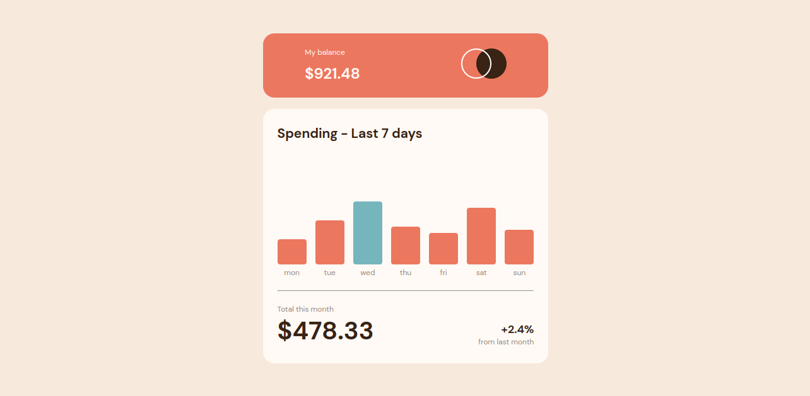

# Frontend Mentor - Expenses chart component solution

This is a solution to the [Expenses chart component challenge on Frontend Mentor](https://www.frontendmentor.io/challenges/expenses-chart-component-e7yJBUdjwt). Frontend Mentor challenges help you improve your coding skills by building realistic projects. 

## Table of contents

- [Overview](#overview)
  - [Screenshot](#screenshot)
  - [Links](#links)
- [My process](#my-process)
  - [Built with](#built-with)
- [Author](#author)

## Overview

### Screenshot

### Links

- Solution URL: (https://expenses-chart-six.vercel.app/)

## My process

### Built with

- Semantic HTML5 markup
- CSS custom properties
- Flexbox
- Media Queries (Responsive)

## Author

- Website - [Fausto Machava](https://faustomachava.vercel.app/)
- Frontend Mentor - [@fausto-machava](https://www.frontendmentor.io/profile/fausto-machava)
- Github - [@fausto-machava](https://www.github.com/fausto-machava)
- LinkedIn - [@Fausto-Machava](https://www.linkedin.com/in/fausto-machava)
- Twitter - [@Fasthy3](https://www.twitter.com/fasthy3)
